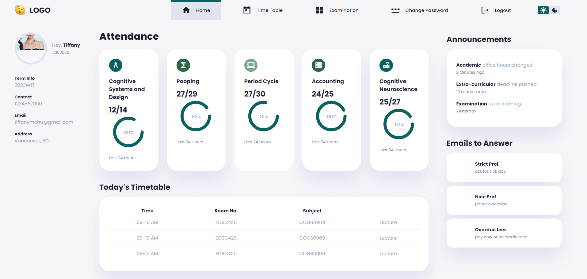

# University Life Management Dashboard

[Life Management Dashboard Site](https://tiffchu.github.io/university-life-management-sys/)

This dashboard provides an intuitive interface for managing various aspects of university life including attendance tracking, timetable management, to do checklist, and account settings.
- has cool hover features
  
## Main Features

- **Easy Navigation:** Easily navigate through different sections like Home, Timetable, Examination, Change Password, and Logout.
- **Profile:** View personal information including course details, contact information, email, and address.
- **Attendance Monitoring :(** Monitor attendance for different subjects with detailed progress indicators.
- **Timetable:** View and manage daily schedules with dynamic navigation.
- **Announcements:** Stay updated with important university announcements.
- **Cool Checklist:** Check off activiates to be done, add future plans. 
- **Emails to Answer:** Manage communication with teachers and staff effectively.

